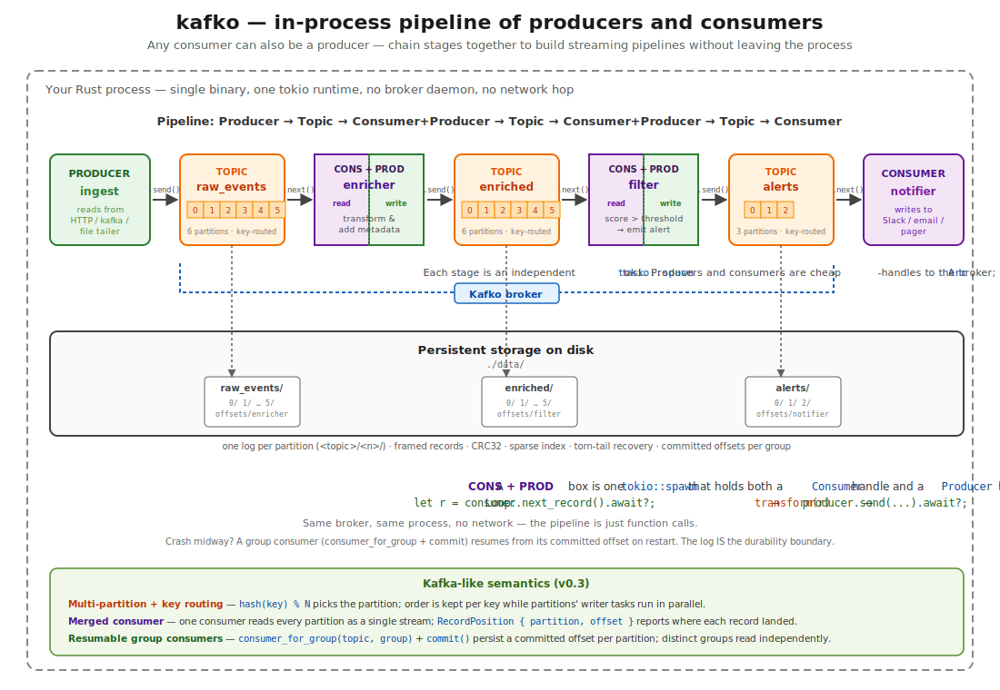

<p align="center">
  <picture>
    <source media="(prefers-color-scheme: dark)" srcset="docs/kafko-wordmark.png">
    
  </picture>
</p>

> **Trademark notice:** Apache Kafka and Kafka are trademarks of the [Apache Software Foundation](https://www.apache.org/). **kafko** is an independent open-source project and is not affiliated with or endorsed by the Apache Software Foundation or Confluent Inc.

# kafko

An in-process log with Kafka-like semantics for Rust. Topics, partitions, offset-based reads, replay, retention, compaction — all without a broker, a network hop, or a JVM.

`kafko` exists for use cases where your data never needs to leave the process: embedded event sourcing, edge buffers, durable in-process pub/sub, deterministic integration tests without Docker or a broker, single-binary services that want a real log instead of a `VecDeque<T>` under a mutex. SQLite is to PostgreSQL what `kafko` is to Kafka.

<p align="center">
  
</p>

## What kafko is

A single Rust crate providing:

- **Topics with partitions** — name a stream, append records, read them back by offset
- **Persistent segments** — records go to disk in framed `[len][crc32][ts][key_len][key][val_len][val]` form; segments rotate by size
- **Offset-based reads** — consumers maintain their own cursor, can seek freely, can replay from anywhere
- **Retention** — drop segments by age or total bytes
- **Compression** — none / lz4 / zstd, configured per topic
- **Compaction** — key-based dedup of the active log (v0.2)
- **Crash recovery** — CRC verification on read, torn-tail truncate on startup
- **Async API on `tokio`** — `Producer::send().await` resolves once the record is appended to the OS file (page cache); see [Durability](#durability) for the exact contract
- **Single-writer-per-partition invariant** — no global mutex on the hot path

The killer use case isn't "replace Kafka." It's **testing log-shaped application code in-process**: open a `Kafko` in the same test binary, call the produce/consume/seek APIs directly, and get offset-aware integration tests without containers, brokers, or flake.

## What kafko is NOT

- Not a competitor to real Kafka — no distribution, no replication, no Kafka wire-protocol
- Not a queue (queues consume = remove; logs are append-only with replay)
- Not a substitute for RabbitMQ-style routing (different category)
- Not for sub-microsecond hot paths (use a matching-engine WAL pattern with `io_uring` + `O_DIRECT` for that)

## Quickstart

```toml
[dependencies]
kafko = "0.2"
tokio = { version = "1", features = ["macros", "rt-multi-thread"] }
bytes = "1"
```

To use a compression codec, opt in via Cargo features — see
[Compression features](#compression-features):

```toml
kafko = { version = "0.2", features = ["compression-lz4"] }
```

```rust
use bytes::Bytes;
use kafko::Kafko;

#[tokio::main]
async fn main() -> kafko::Result<()> {
    let broker = Kafko::open("./data").await?;
    broker.create_topic("orders").await?;

    // Produce
    let producer = broker.producer_for("orders").await?;
    let offset = producer.send(None, Bytes::from("order-1")).await?;
    println!("appended at offset {offset}");

    // Consume from the beginning
    let mut consumer = broker.consumer_for("orders").await?;
    consumer.seek(0);
    let record = consumer.next_record().await?;
    println!("read: {:?}", record.value());

    Ok(())
}
```

### Per-topic compression

```rust
use kafko::{Compression, Kafko, LogConfig};

let broker = Kafko::open("./data").await?;
broker
    .create_topic_with_config(
        "metrics",
        LogConfig { compression: Compression::Zstd, ..Default::default() },
    )
    .await?;
```

### Compression features

LZ4 and Zstd are opt-in via Cargo features, so a default `cargo add kafko`
pulls in no compression dependencies. Pick what you need:

| Feature | Adds to deps | Enables variant |
|---|---|---|
| _(default)_ | _(nothing)_ | `Compression::None` only |
| `compression-lz4` | `lz4_flex 0.13` | `Compression::Lz4` |
| `compression-zstd` | `zstd 0.13` | `Compression::Zstd` |
| `compression-all` | both above | both |

The `Compression::Lz4` and `Compression::Zstd` variants are visible in the
public API regardless of features — a build without the matching codec returns
`KafkoError::CompressionUnavailable(codec)` instead of mis-decoding bytes,
so a reader built without (e.g.) LZ4 can still detect and gracefully reject
segments written by an LZ4-enabled producer. Call `Compression::is_available()`
for a runtime check.

## Architecture

One broker object, many cheap handles. Each partition has its own writer task that exclusively owns the active segment file. **No global mutex on the hot path.**

```
                ┌─────────────────────────────────────┐
                │  Kafko (Arc<KafkoInner>)            │
                │  - Topic registry (RwLock)          │
                │  - HashMap<(topic,part), Handle>    │
                └────────┬────────────────────────────┘
                         │ Arc::clone (cheap)
        ┌────────────────┼────────────────┐
        │                │                │
   Producer         Producer         Consumer
        │                │                │
        │   send via per-partition inbox  │
        └────────────────▼────────────────┘
              ┌──────────┴──────────┐
              ▼                     ▼
       Partition writer task    Partition writer task
       (single mpsc owner)      (single mpsc owner)
              │                     │
              ▼                     ▼
       orders-0/ segments      payments-0/ segments
```

## Durability

kafko v0.1 provides the **same durability contract as Kafka with `acks=1`** — leader has the record in page cache, not necessarily on disk:

- `Producer::send().await` resolves once the record has been written to the OS file via `write_all`. The bytes are in the **OS page cache**, owned by the kernel — they survive process crashes (panic, SIGKILL, OOM) because the process doesn't own them.
- `Producer::send().await` does **not** fsync. Records may be lost if the OS crashes, the kernel panics, or the host loses power before automatic writeback (typically seconds on Linux / Windows).
- Torn or partial writes at the tail of the active segment are detected and truncated on next startup via CRC scan; the sparse index is rebuilt from the verified segment.
- For stricter guarantees, the partition exposes an explicit `sync()` you can call after `send`. A configurable per-call fsync policy (`EveryRecord` / `EveryBatch` / `EveryNms` / `Never`) is on the v0.2 roadmap.

### Graceful shutdown

`Kafko::shutdown().await` is a real durability boundary: every partition's writer task drains its inbox, fsyncs the active segment, and exits before the call returns. Any record that was acked to a producer before `shutdown` was called is on disk by the time `shutdown` resolves.

Host applications that care about durability across `SIGTERM` / `SIGINT` / `docker stop` should install a signal handler that drives `shutdown().await` to completion before exiting:

```rust,no_run
tokio::signal::ctrl_c().await.ok();
broker.shutdown().await?;
```

`SIGKILL`, OS panic, and power loss bypass userspace and cannot be intercepted; the recovery path on the next `Kafko::open` handles torn tails via CRC scan, but any record whose page-cache bytes had not yet been written back by the kernel may be lost.

**Drop-without-shutdown fallback.** If you let the broker go out of scope without calling `shutdown()`, kafko's `Drop` impl runs the same graceful shutdown as a best-effort fallback:

- On a **multi-thread tokio runtime** (the default `#[tokio::main]`), Drop uses `block_in_place` + `block_on` to drive every partition's writer task to completion before returning. Durability is identical to explicit `shutdown()`; you just lose the ability to observe any error it might have returned.
- On a **current-thread runtime**, Drop can't safely block — it spawns the cleanup detached and may not complete before runtime teardown. Call `shutdown().await` explicitly in this case.
- With **no reachable tokio runtime**, Drop releases the directory lock and lets the writer tasks die with their host runtime.

This contract is identical to what Kafka calls `acks=1`. If you need `acks=all`-style multi-replica durability, kafko is not the right tool — use Kafka.

## Benchmarks

All numbers measured on a single machine. Two complementary views: the **HTTP path** (kafko exposed via `kafko-http` over Docker container loopback, driven by `oha`) and the **library hot path** (in-process via `Producer::send().await` from `crates/kafko-bench`). The first matters when kafko is behind a network listener; the second matters when it's embedded.

Reproducible from `scripts/kafko_docker_bench.ps1` (HTTP) and `cargo run --release -p kafko-bench` (in-process).

### Methodology

| | HTTP path | In-process |
|---|---|---|
| Driver | `oha` (in container), 16 concurrent connections, one HTTP request per record | 16 `tokio::spawn` tasks each calling `Producer::send().await` in a loop |
| Server | axum 0.7 + kafko on port 9091 | (none — in-process) |
| Durability | record in OS file (page cache) at `send().await` | same |
| Payload | all-zero bytes | all-zero bytes |
| Compression codecs | none / lz4 / zstd (per-topic) | same |
| Runtime | `multi_thread`, default worker count (one per logical CPU) | `multi_thread, worker_threads = 4` |

### HTTP path — records/sec (16 concurrent producers, wall-clock aggregate, v0.2.0)

| Size | none | lz4 | zstd |
|---|---:|---:|---:|
| 64 B    | 138,235 | 138,422 | 123,325 |
| 256 B   | 135,296 | 131,267 | 124,534 |
| 512 B   | 130,665 | 133,469 | 122,423 |
| 1 KiB   | 128,327 | 132,557 | 123,312 |
| 4 KiB   |  52,667 | 127,308 | 110,416 |
| 128 KiB |  12,123 |  40,426 |  44,621 |
| 1 MiB   |     976 |   6,109 |   4,787 |

### HTTP path — MiB/s committed (v0.2.0)

| Size | none | lz4 | zstd |
|---|---:|---:|---:|
| 64 B    |     8.4 |     8.4 |     7.5 |
| 256 B   |    33.0 |    32.0 |    30.4 |
| 1 KiB   |   125.3 |   129.5 |   120.4 |
| 4 KiB   |   205.7 | **497.3** | **431.3** |
| 128 KiB | **1,516** | **5,053** | **5,578** |
| 1 MiB   |     976 |   6,109 |   4,787 |

### HTTP path — latency p50 (codec = none, v0.2.0)

| Size | p50 |
|---|---:|
| 64 B    | 0.11 ms |
| 256 B   | 0.11 ms |
| 512 B   | 0.11 ms |
| 1 KiB   | 0.12 ms |
| 4 KiB   | 0.16 ms |
| 128 KiB | 1.29 ms |
| 1 MiB   | 10.43 ms |

Latency is `oha`'s synchronous-per-connection request-response time (send → wait → receive → next), so this is honest end-to-end HTTP RTT through the kafko stack including write-to-page-cache.

### Library hot path — records/sec (in-process, no HTTP, single `send()` per record, v0.2.0)

For users who embed kafko directly — the killer use case — the library-only numbers below show **single-`send()` per record** throughput across record sizes. Each row is `kafko-bench --features compression-all` driving 1 producer in a tight loop of `producer.send().await` calls; one round-trip through the partition writer per record.

| Size | none | lz4 | zstd |
|---|---:|---:|---:|
| 64 B    |   282,619 |   285,377 |   238,996 |
| 256 B   |   273,199 |   286,711 |   238,283 |
| 1 KiB   |   216,075 |   267,409 |   242,199 |
| 4 KiB   |   120,315 |   260,233 |   228,961 |
| 128 KiB |    11,128 |    51,606 |    52,127 |
| 1 MiB   |     3,032 |    10,561 |     5,283 |

**LZ4 beats `None` at every size** in v0.2.0 — at small records the per-call hash-table alloc is gone (see [Codec allocation profile](#codec-allocation-profile-v020)), and at large records the smaller on-disk write more than pays for the compression CPU. The 4 KiB cell is where `Compression::Lz4` first pulls clearly ahead: 260 K rec/s vs `None`'s 120 K, a 2.2× speedup.

For **batched** throughput at the same record size, see the `send_batch` table below — small-record amortization there reaches **3.66 M rec/s** for `None` and **4.05 M rec/s** for `Lz4` at N = 1024.

Reproduce: `.\scripts\kafko_lib_multisize_bench.ps1`. Function-level timing + allocation snapshots and full methodology in `crates/kafko-bench/baselines/`.

### Library hot path — `send_batch` vs single `send` (v0.2.0, 256 B records)

Same in-process path as above, but driven by `cargo bench -p kafko --bench send_batch` so a single producer either calls `send_batch(N)` once or loops N single `send()` calls. The gap is the mpsc round-trip cost saved per record.

| Records per call (N) | `send_batch(N)` | Loop of N × `send()` | **Speedup** |
|---:|---:|---:|---:|
| 1 | 267 K rec/s | 273 K rec/s | 1.0× |
| 8 | 1.14 M rec/s | 276 K rec/s | **4.1×** |
| 32 | 1.61 M rec/s | 281 K rec/s | **5.7×** |
| 128 | 2.92 M rec/s | 286 K rec/s | **10.2×** |
| 1024 | **3.66 M rec/s** | 274 K rec/s | **13.3×** |

The single-`send` floor of ~275 K rec/s is the mpsc actor round-trip (~3.6 µs per record); batching saves `(N − 1)` of those round-trips and lowers to one `Log::append_batch` call. The curve flattens by N = 128 and is fully amortized by N = 1024.

#### `send_batch` with compression (256 B all-zero values)

| Compression | N = 1 | N = 128 | N = 1024 |
|---|---:|---:|---:|
| None | 267 K | 2.92 M | 3.66 M |
| **Lz4** | 286 K | 3.01 M | **4.05 M** |
| Zstd | 241 K | 1.06 M | 1.15 M |

**Lz4 is faster than None at large batches** because the all-zero payload compresses ~96 %, so the writer task spends proportionally less time on disk I/O. With genuinely random / incompressible data, expect Lz4 to track None within ±10 %. The per-record LZ4 hash-table allocation that hurt v0.1.1's memory profile is gone in v0.2.0 — see [Codec allocation profile](#codec-allocation-profile-v020) below.

Reproduce: `cargo bench -p kafko --bench send_batch --features compression-all -- --baseline v0_2_0` (compares against the pinned v0.2.0 baseline under `target/criterion/`; pass `--baseline v0_1_1` to compare against the v0.1.1 baseline preserved in the same tree).

### Codec allocation profile (v0.2.0)

Both LZ4 and Zstd are alloc-free on the write hot path after thread warm-up.

- **LZ4** (`Compression::Lz4`) — kafko parks a per-thread `CompressTable`
  in `compression.rs` and routes encodes through `lz4_flex 0.13`'s
  `compress_into_with_table`, which clears the caller-owned hash table in
  place instead of allocating a fresh one per call. Cost: **one 8 KiB
  allocation per encoder thread for the process lifetime**, not per record.
- **Zstd** (`Compression::Zstd`) — `zstd::bulk::Compressor` is held in a
  thread-local and reuses its internal state across calls.

Measured in the kafko-bench `lz4_sequential` scenario (100 000 LZ4 sends,
256 B records, in-process): `compression::compress` allocates **24.9 KiB
total** across the run — three thread-local hash tables, one per worker
thread that touched the LZ4 path. That's **0.10 % of total process
allocation** under the same workload that previously attributed ~93 % of
heap traffic to this single function on v0.1.1's `lz4_flex 0.11`.

Throughput-wise, LZ4 sequential now tracks no-codec sequential within ~3 %
(164 K vs 160 K rec/s in the same hotpath-instrumented harness) — LZ4 is no
longer detectably more expensive than `None` on small-record workloads.

Reproduce: `.\scripts\kafko_hotpath_matrix.ps1` and read the resulting
`scripts\tmp\hotpath_<ts>\lz4_sequential.txt` (the `compression::compress`
row of the `alloc-bytes` table is the headline).

## Performance recipes — pick once, ship it

Default config is **already near-optimum for single-producer workloads** — the `preset_configs/throughput_oriented` bench buys only ~4 % over `LogConfig::default()`. So the recipes below mostly differ in **which API you call** (`send` vs `send_batch`) and **which codec you pick**, not in `LogConfig` tuning.

All throughput numbers are 256 B records, single producer, in-process. Larger records hit MiB/s ceilings sooner — see the size matrices above.

| Goal | API | Compression | `LogConfig` | Expected throughput | Per-record latency |
|---|---|---|---|---|---|
| **Max throughput, compressible payloads** | `send_batch(N≥128)` | `Lz4` | `default()` | **~4.0 M rec/s** | amortized over batch |
| **Max throughput, incompressible payloads** | `send_batch(N≥128)` | `None` | `default()` | **~3.7 M rec/s** | amortized over batch |
| **Disk-efficient (best compression ratio)** | `send_batch(N≥32)` | `Zstd` | `default()` | ~1.1 M rec/s | amortized over batch |
| **Lowest single-record latency** | `send()` | `None` | `default()` | ~275 K rec/s | **~3.6 µs / send** |
| **Many concurrent producers, no batch API** | `send()` × N tasks | `None` or `Lz4` | bump `batch_max_bytes` to 1 MiB | scales with concurrency until disk caps | ~3.6 µs / send |

### Recipe 1 — Max throughput (compressible data)

```rust
use bytes::Bytes;
use kafko::{Compression, Kafko, LogConfig};

let broker = Kafko::open("./data").await?;
broker
    .create_topic_with_config(
        "events",
        LogConfig { compression: Compression::Lz4, ..Default::default() },
    )
    .await?;

let producer = broker.producer_for("events").await?;

// Stage 128+ records per call. The mpsc-round-trip cost amortizes ~10× vs a loop of send().
let batch: Vec<(Option<Bytes>, Bytes)> = (0..1024)
    .map(|i| (None, Bytes::from(format!("event-{i}"))))
    .collect();
let offsets = producer.send_batch(batch).await?;
```

Expect **~4.0 M rec/s** for redundant / structured payloads (e.g., JSON, logs, protobuf with shared schemas). Lz4 is genuinely free here — the disk-I/O saved more than pays for the compression CPU, and the per-call hash-table allocation that hurt v0.1.1's memory profile is gone in v0.2.0.

### Recipe 2 — Max throughput (incompressible data)

Same shape, but pick `Compression::None` (or `Lz4` — it tracks `None` within
~3 % on incompressible data now that the per-call hash-table alloc is gone, so
either choice is fine):

```rust
broker
    .create_topic_with_config(
        "events",
        LogConfig { compression: Compression::None, ..Default::default() },
    )
    .await?;
// ...same send_batch(N≥128) loop as Recipe 1
```

Expect **~3.7 M rec/s** for already-compressed payloads (encrypted blobs, JPEG/MP4 frames, random IDs).

### Recipe 3 — Lowest single-record latency

When you can't batch — interactive request handling, event-by-event ingestion from an upstream stream — use `send()` directly:

```rust
let producer = broker.producer_for("events").await?;
let offset = producer.send(None, Bytes::from("one event")).await?;
```

Floor: ~**3.6 µs per send** (mpsc → writer-task → write-to-page-cache → reply), ~275 K rec/s per producer. **Compression doesn't help here** — at this latency scale the codec cost dominates over disk savings.

### Recipe 4 — Many concurrent producers

When you have N producer tasks all hitting the same topic, kafko's writer task already **coalesces concurrent appends into batched disk writes** (the "natural batching" path). You don't need to write `send_batch` glue — just call `send()` in each task and bump the natural-batch ceiling:

```rust
broker
    .create_topic_with_config(
        "events",
        LogConfig {
            // Default is 64 KiB; raise to 1 MiB so more sends coalesce into each disk write.
            batch_max_bytes: 1024 * 1024,
            batch_max_records: 8192,
            ..Default::default()
        },
    )
    .await?;

let producer = broker.producer_for("events").await?;
// Spawn N tasks each calling producer.clone().send(...) in a loop.
```

Throughput scales with concurrency until disk bandwidth caps. The hotpath profiler shows ~6 sends coalesced per disk write under default `batch_max_bytes`; raising it lets that grow.

### What NOT to tune

The `config_sweep` bench data settled these — don't waste time on:

- **`segment_size_threshold`** — anywhere between 1 MiB and 256 MiB performs within noise. The default 1 GiB is fine for almost any workload; only drop it if you genuinely need smaller files on disk.
- **`index_interval`** — the default 4 KiB is the sweet spot. Smaller (≤ 1 KiB) measurably hurts because of constant index writes; larger (≥ 32 KiB) doesn't help.
- **`segment_size_threshold` below 1 MiB** — the `small_footprint` preset in `config_sweep` is **32 % slower** than default because rotation pressure dominates. Only worth it if you're disk-constrained AND read-heavy on cold data.

## What's in (v0.2.0)

- Single partition per topic
- Single consumer per topic
- File-based segments with CRC32 integrity
- Crash recovery on startup (torn-tail truncate, sparse index rebuild)
- Time- and size-based retention
- Producer + Consumer async API on `tokio`
- Per-topic compression (none / lz4 / zstd) — codecs are opt-in via Cargo
  features (`compression-lz4`, `compression-zstd`, `compression-all`); default
  build has zero compression dependencies
- LZ4 hot-path allocation amortized to one 8 KiB workspace per encoder thread
  via lz4_flex 0.13's `compress_into_with_table` (down from one alloc per record)
- `Producer::send_batch` for atomic, single-round-trip batched appends
- Data-directory lockfile — concurrent `Kafko::open` on the same dir fails fast
- Writer-task panic recovery — typed `KafkoError::PartitionPanicked`
- Graceful shutdown via explicit `shutdown().await` or `Drop` fallback
- `kafko-http` — a separate workspace crate (`crates/kafko-http/`) exposing
  the broker over HTTP for integration testing and benchmarking

## Roadmap

- Multi-partition with key-based routing
- Consumer groups with independent committed offsets
- Log compaction (key-based dedup)
- Configurable fsync policy (`EveryRecord` / `EveryBatch` / `EveryNms` / `Never`)
- Headers / record metadata
- Per-topic config persistence (currently a topic's compression is set at
  creation but not persisted across restarts)
- Buffered WAL via `BufWriter` (design parked in `docs/design-bufwriter.md`;
  amortizes the per-record `write()` syscall, expected ~40 % sequential
  throughput win)

## Not on the roadmap

- Kafka wire-protocol compatibility (different category of tool)
- Distributed replication (kafko is in-process by design — if you need replication, use Kafka)
- Schema registry, Connect, Streams ecosystem (out of scope)

## Building and benchmarking

This is a Cargo workspace. The library crate is `crates/kafko/` (publishable to crates.io); the HTTP test harness is `crates/kafko-http/` (`publish = false`).

```bash
# Workspace check (lib + http harness + tests + benches)
cargo check --workspace --all-targets

# Build only the library
cargo build --release --package kafko

# Build the HTTP test harness binary
cargo build --release --package kafko-http
#   → target/release/kafko-http(.exe)

# Run all tests
cargo test --workspace

# Run kafko storage micro-benchmarks (criterion)
cargo bench --package kafko

# Reproduce the HTTP-path bench (Windows PowerShell, requires Docker)
.\scripts\kafko_docker_bench.ps1

# Reproduce the in-process library bench
cargo run --release -p kafko-bench
```

See [`scripts/README.md`](scripts/README.md) for the full bench-script catalogue.

## Fuzzing

The `fuzz/` directory holds cargo-fuzz targets for the wire-format trust boundary. It is deliberately outside the main workspace because libFuzzer requires a nightly toolchain and the cargo-fuzz CLI, which are overkill for the regular build and test cycle.

```bash
# One-time setup
cargo install cargo-fuzz
rustup toolchain install nightly

# Run a target (continues until Ctrl-C; corpus + crash artifacts persist under fuzz/)
cargo +nightly fuzz run decode_record

# Reproduce a saved crash artifact
cargo +nightly fuzz run decode_record fuzz/artifacts/decode_record/<artifact-id>
```

Existing targets:

- `decode_record` — feeds arbitrary bytes to `Record::decode`. Catches the truncation, CRC-mismatch, and invalid-length paths; rarely reaches deeper code because random bytes almost never pass the CRC.
- `decode_record_structured` — hand-builds a wire-format record with chosen flag/key/value bytes and a **valid CRC**, so the decoder reaches the flag-parse and decompress paths that the unstructured target almost never exercises. The decompressor wrappers (lz4_flex, zstd) must not panic on adversarial payloads.
- `recovery_torn_tail` — feeds arbitrary bytes as the active segment file (`00…0.log`) and runs `Log::open`. Recovery must find the longest valid prefix, truncate the rest, and produce a Log where every offset in `[0, next_offset)` reads back successfully.
- `sparse_index_parse` — feeds arbitrary bytes as the `00…0.index` file and exercises both `SparseIndex::open` and `lookup(u64)` against the parsed result. Neither must panic regardless of how malformed the entry table is.
- `log_op_sequence` — model-based fuzzer that generates an `Arbitrary` sequence of `(append, sync, read, retention)` operations against a fresh `Log` with `Arbitrary` `LogConfig` (small thresholds force rotation pressure). Checks state-machine invariants: offsets are monotonic, no panic on any input, no committed-record corruption.

## License

Licensed under **MIT OR Apache-2.0**, at your option. See [LICENSE-MIT](LICENSE-MIT) and [LICENSE-APACHE](LICENSE-APACHE).
