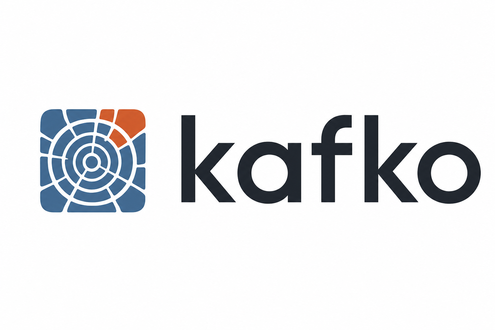

<p align="center">
  <picture>
    <source media="(prefers-color-scheme: dark)" srcset="../../docs/kafko-wordmark.png">
    
  </picture>
</p>

> **Trademark notice:** Apache Kafka and Kafka are trademarks of the [Apache Software Foundation](https://www.apache.org/). **kafko** is an independent open-source project and is not affiliated with or endorsed by the Apache Software Foundation or Confluent Inc.

# kafko

An in-process log with Kafka-like semantics for Rust. Topics, partitions, offset-based reads, replay, retention, compaction — all without a broker, a network hop, or a JVM.

`kafko` exists for use cases where your data never needs to leave the process: embedded event sourcing, edge buffers, durable in-process pub/sub, deterministic integration tests without Docker or a broker, single-binary services that want a real log instead of a `VecDeque<T>` under a mutex. SQLite is to PostgreSQL what `kafko` is to Kafka.

## What kafko is

A single Rust crate providing:

- **Topics with partitions** — name a stream, append records, read them back by offset
- **Persistent segments** — records go to disk in framed `[len][crc32][ts][key_len][key][val_len][val]` form; segments rotate by size
- **Offset-based reads** — consumers maintain their own cursor, can seek freely, can replay from anywhere
- **Retention** — drop segments by age or total bytes
- **Compression** — none / lz4 / zstd, configured per topic
- **Compaction** — key-based dedup of the active log (v0.2)
- **Crash recovery** — CRC verification on read, torn-tail truncate on startup
- **Async API on `tokio`** — `Producer::send().await` resolves once the record is appended to the OS file (page cache); see [Durability](#durability) for the exact contract
- **Single-writer-per-partition invariant** — no global mutex on the hot path

The killer use case isn't "replace Kafka." It's **testing log-shaped application code in-process**: open a `Kafko` in the same test binary, call the produce/consume/seek APIs directly, and get offset-aware integration tests without containers, brokers, or flake.

## What kafko is NOT

- Not a competitor to real Kafka — no distribution, no replication, no Kafka wire-protocol
- Not a queue (queues consume = remove; logs are append-only with replay)
- Not a substitute for RabbitMQ-style routing (different category)
- Not for sub-microsecond hot paths (use a matching-engine WAL pattern with `io_uring` + `O_DIRECT` for that)

## Quickstart

```toml
[dependencies]
kafko = "0.1"
tokio = { version = "1", features = ["macros", "rt-multi-thread"] }
bytes = "1"
```

```rust
use bytes::Bytes;
use kafko::Kafko;

#[tokio::main]
async fn main() -> kafko::Result<()> {
    let broker = Kafko::open("./data").await?;
    broker.create_topic("orders").await?;

    // Produce
    let producer = broker.producer_for("orders").await?;
    let offset = producer.send(None, Bytes::from("order-1")).await?;
    println!("appended at offset {offset}");

    // Consume from the beginning
    let mut consumer = broker.consumer_for("orders").await?;
    consumer.seek(0);
    let record = consumer.next_record().await?;
    println!("read: {:?}", record.value());

    Ok(())
}
```

### Per-topic compression

```rust
use kafko::{Compression, Kafko, LogConfig};

let broker = Kafko::open("./data").await?;
broker
    .create_topic_with_config(
        "metrics",
        LogConfig { compression: Compression::Zstd, ..Default::default() },
    )
    .await?;
```

## Durability

kafko v0.1 provides the **same durability contract as Kafka with `acks=1`** — leader has the record in page cache, not necessarily on disk:

- `Producer::send().await` resolves once the record has been written to the OS file via `write_all`. The bytes are in the **OS page cache**, owned by the kernel — they survive process crashes (panic, SIGKILL, OOM) because the process doesn't own them.
- `Producer::send().await` does **not** fsync. Records may be lost if the OS crashes, the kernel panics, or the host loses power before automatic writeback (typically seconds on Linux / Windows).
- Torn or partial writes at the tail of the active segment are detected and truncated on next startup via CRC scan; the sparse index is rebuilt from the verified segment.
- For stricter guarantees, the partition exposes an explicit `sync()` you can call after `send`. A configurable per-call fsync policy (`EveryRecord` / `EveryBatch` / `EveryNms` / `Never`) is on the v0.2 roadmap.

If you need `acks=all`-style multi-replica durability, kafko is not the right tool — use Kafka.

## Architecture

One broker object, many cheap handles. Each partition has its own writer task that exclusively owns the active segment file. **No global mutex on the hot path.**

```
                +-------------------------------------+
                |  Kafko (Arc<KafkoInner>)            |
                |  - Topic registry (RwLock)          |
                |  - HashMap<(topic,part), Handle>    |
                +--------+----------------------------+
                         | Arc::clone (cheap)
        +----------------+----------------+
        |                |                |
   Producer         Producer         Consumer
        |                |                |
        |   send via per-partition inbox  |
        +----------------v----------------+
              +----------+----------+
              v                     v
       Partition writer task    Partition writer task
       (single mpsc owner)      (single mpsc owner)
              |                     |
              v                     v
       orders-0/ segments      payments-0/ segments
```

## v0.1 — what's in

- Single partition per topic
- Single consumer per topic
- File-based segments with CRC32 integrity
- Crash recovery on startup (torn-tail truncate)
- Time- and size-based retention
- Producer + Consumer async API on `tokio`
- Per-topic compression (none / lz4 / zstd)

## v0.2 — roadmap

- `Producer::send_batch` for opportunistic batching (no `linger.ms` window)
- Multi-partition with key-based routing
- Consumer groups with independent committed offsets
- Log compaction (key-based dedup)
- Configurable fsync policy (`EveryRecord` / `EveryBatch` / `EveryNms` / `Never`)
- Headers / record metadata
- Per-topic config persistence

## Not on the roadmap

- Kafka wire-protocol compatibility (different category of tool)
- Distributed replication (kafko is in-process by design — if you need replication, use Kafka)
- Schema registry, Connect, Streams ecosystem (out of scope)

## Benchmarks

Apples-to-apples benchmarks against real Kafka (in Docker, single record per request, 16 concurrent producers) live in the repository at <https://github.com/Vadimus1983/kafko>. Reproducible from the scripts in the `scripts/` folder.

## License

Licensed under **MIT OR Apache-2.0**, at your option. See [LICENSE-MIT](../../LICENSE-MIT) and [LICENSE-APACHE](../../LICENSE-APACHE).
